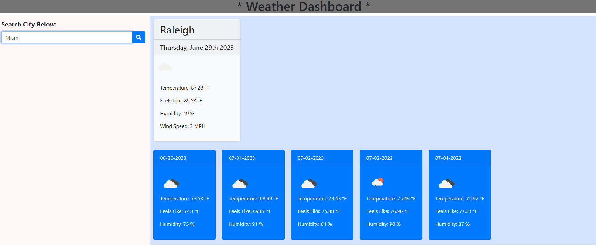

# Serverside-Api-Weather-Dashboard
A weather dashboard that will run in the browser and feature dynamically updated HTML and CSS.

- My motivation for this project was to build an application that would allow me to practice fetching for data from a server.
- I built this project to practice using server side APIs.
- This challenge will help me better understand how developers use serverside api to retrieve data.
- I learned that there are hundres of different APIs out there, but not all of them are open source.

## Screenshot
 